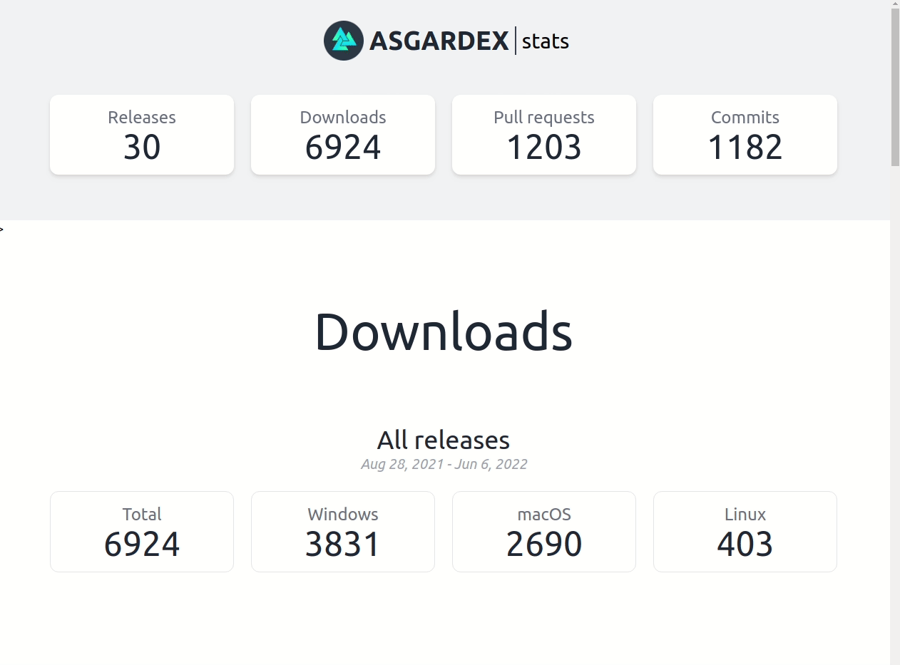

# ASGARDEX stats

_Statistics of [ASGARDEX desktop releases](https://github.com/thorchain/asgardex-electron/releases)_

**LIVE** :eyes: https://veado.github.io/asgardex-stats/



### Where does the data come from?

All data are consumed from GitHub API https://docs.github.com/rest

### Local development

```bash
npm i
npm run dev
```

## Built with (in alphabetical order)

- [fp-ts](https://gcanti.github.io/fp-ts/)
- [Frappe charts](https://frappe.io/charts) / [svelte-frappe-charts](https://github.com/himynameisdave/svelte-frappe-charts)
- [Grid.js](https://gridjs.io) / [gridjs-svelte](https://github.com/iamyuu/gridjs-svelte)
- [RxJS](https://rxjs.dev)
- [Svelte](https://svelte.dev)
- [tailwindcss](https://tailwindcss.com)
- [TypeScript](https://www.typescriptlang.org/)
- [Vite](https://vitejs.dev/)

## Licence

[MIT](./LICENSE)
